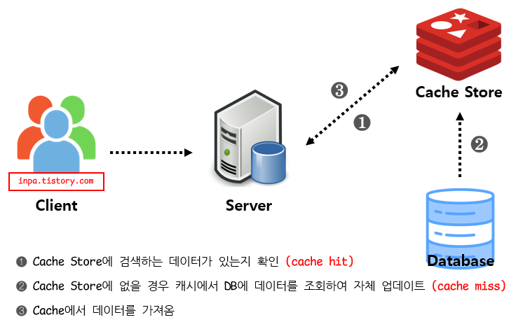

## cache

### 캐시란?
컴퓨터 분야에 사용되는 용어로, 데이터를 미리 복사해 놓는 임시 장소를 가리킨다. 캐시를 이용하지 않았을 때의 데이터 접근 시간이 오래 걸리는 경우나 값을 다시 연산하는 시간을 단축하기 위해 사용된다. 데이터가 본래 저장되어 있던 장소보다 접근 시간이 더 빠른 별도의 장소에 데이터를 미리 복사해 놓으면 계산이나 접근 시간 없이 더 빠른 속도로 데이터에 접근할 수 있다.

### 캐싱 전략
캐시는 데이터를 저장하는 장소이기 때문에 데이터를 어떻게 저장하고 어떻게 관리할지에 대한 전략이 필요하다. 캐시 전략은 크게 5가지로 나눌 수 있다.

> write

#### 1. Write-Through

- 개념: 데이터를 캐시에 먼저 저장한 후, 동시에 데이터베이스(DB)에도 저장하는 방식.
- 장점:
  - 데이터 일관성을 유지하기 용이함.
  - 자주 조회되는 데이터가 캐시에 항상 존재함.
- 단점:
  - 모든 쓰기 연산이 캐시를 거치므로 쓰기 성능이 낮아질 수 있음.
- 사용 예시:
  - 자주 변경되지 않는 데이터(e.g., 제품 정보, 설정값)
  - 데이터 일관성이 중요한 시스템(e.g., 금융, 주문)

#### 2. Write-Back (Write-Behind) Cache

- 개념: 데이터를 우선 캐시에 저장한 후, 일정 시간이나 특정 조건이 충족되었을 때 DB에 반영하는 방식.  (비동기 쓰기 방식이라고도 함.)
- 장점:
  - 쓰기 속도가 빠름 (즉각적으로 DB에 반영하지 않으므로).
  - 여러 번 변경된 데이터를 한 번만 DB에 반영할 수 있어 성능 최적화 가능.
- 단점:
  - 캐시에 저장된 데이터가 DB에 반영되기 전에 장애가 발생하면 데이터 유실 가능.
  - 데이터 일관성이 보장되지 않을 수 있음.
- 사용 예시:
  - 쓰기 연산이 많은 시스템(e.g., 로그 저장, 임시 데이터)
  - 데이터 일관성이 중요하지 않은 시스템(e.g., 로그, 세션)

#### 3. Write-Around Cache

- 개념: 데이터를 캐시에 저장하지 않고, 직접 DB에 저장하는 방식.  데이터를 직접 DB에 저장하고, 캐시는 주로 읽기 시 활용한다.
- 장점:
  - 캐시가 불필요한 데이터를 저장하지 않아 메모리 효율적.
- 단점:
  - cache miss가 발생하기 전에 데이터베이스에 저장된 데이터가 수정되었을 때, 사용자가 조회하는 cache와 데이터베이스 간의 데이터 불일치가 발생
- 사용 예시:
  - 자주 사용되지 않는 데이터(e.g., 신규 사용자 계정 정보).

---

> read

#### 4. Read-Through Cache

- 개념: 애플리케이션이 캐시에서 데이터를 요청하면, 캐시 시스템이 내부적으로 DB를 조회하여 데이터를 가져오고, 그 결과를 캐시에 저장한 후 반환한다.
- 장점:
  - 애플리케이션이 별도 캐시 관리 로직을 구현할 필요 없음
  - 읽기 성능 개선 및 DB 부하 감소
- 단점:
  - 캐시 미스 발생 시 DB 조회로 인한 초기 응답 지연
  - 쓰기 연산 처리는 별도 전략(Write-Through/Back 등)로 해결해야 함
  - 캐시 장애가 전체 서비스에 영향을 줄 수 있음
- 사용 예시:
  - 자주 조회되는 정적인 데이터(e.g., 상품 정보, 설정값).

#### 5. Cache-aside (Look Aside)

- 개념: 애플리케이션이 먼저 캐시를 조회하고, 캐시에 데이터가 없으면 애플리케이션이 직접 DB에서 가져와 캐시에 저장한 후 반환하는 방식. _일반적으로 사용되는 캐시 전략._
- 장점:
  - 자주 사용되는 데이터만 캐시에 저장되므로 메모리 관리가 효율적.
  - 캐시에 장애가 발생하더라도 DB에 요청을 전달함으로써 캐시 장애로 인한 서비스 문제는 대비할수 있다.
- 단점:
  - 첫 번째 요청 시 캐시에 데이터가 없어 DB를 조회해야 함(초기 성능 저하).
  - 단건 호출 빈도가 높은 서비스에 적합하지 않다.
- 사용 예시:
  - 읽기 요청이 많은 서비스(e.g., 뉴스, 블로그, SNS 피드)
  - 반복적으로 동일 쿼리를 수행하는 서비스에 적합.

#### Read-Through vs. Cache-Aside
- Read-Through:
  - 캐시 미스 발생 시 캐시 시스템이 DB를 조회하여 데이터를 가져옴
  - 캐시 업데이트 책임이 캐시 시스템에 있음
- Cache-aside:
  - 캐시 미스 발생 시 애플리케이션이 직접 DB를 조회하고, 결과를 캐시에 반영함
  - 캐시와 DB 간 데이터 관리 책임이 애플리케이션에 있음
- 주체가 누구냐에 따라 책임이 달라짐.

#### 캐시 스탬피드(Cache Stampede)
- 개념: 캐시 스탬피드란 특정 데이터가 만료(TTL)되었을 때, 다수의 요청이 동시에 캐시를 조회하고, 데이터가 없으므로 동시에 DB를 조회하여 부하가 폭증하는 현상을 의미한다.
- 발생 과정
  1. 다수의 클라이언트가 동일 데이터를 캐시에서 요청함
  2. 캐시의 TTL 만료로 인해 데이터가 제거되고, 첫 요청 이후 모두 DB 조회를 시도
  3. 동시 다발적인 DB 접근으로 부하가 급증
  4. DB 응답 지연 또는 서버 과부하로 인한 장애 발생
- 해결 방법
  - 분산 TTL (TTL Jitter):  
    캐시 만료 시간을 랜덤하게 분산시켜 동시에 캐시 갱신이 일어나지 않도록 조정
  - Background Refresh:  
    캐시 만료 전에 백그라운드에서 데이터를 미리 갱신하여 캐시 미스를 방지
  - 락(Lock) 메커니즘:  
    캐시 미스 시 첫 번째 요청에만 DB 조회를 허용하고, 나머지 요청은 대기하도록 락을 적용

---

> reference
> - https://inpa.tistory.com/entry/REDIS-%F0%9F%93%9A-%EC%BA%90%EC%8B%9CCache-%EC%84%A4%EA%B3%84-%EC%A0%84%EB%9E%B5-%EC%A7%80%EC%B9%A8-%EC%B4%9D%EC%A0%95%EB%A6%AC#write_around_%ED%8C%A8%ED%84%B4
> - https://makedotworld.tistory.com/104
> - https://velog.io/@qkrtkdwns3410/%EA%B0%9C%EB%B0%9C%EC%9E%90%EB%A5%BC-%EC%9C%84%ED%95%9C-%EB%A0%88%EB%94%94%EC%8A%A4-%EC%BA%90%EC%8B%9C-%EC%8A%A4%ED%83%AC%ED%94%BC%EB%93%9C-%ED%98%84%EC%83%81
