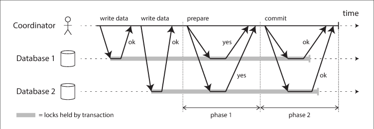
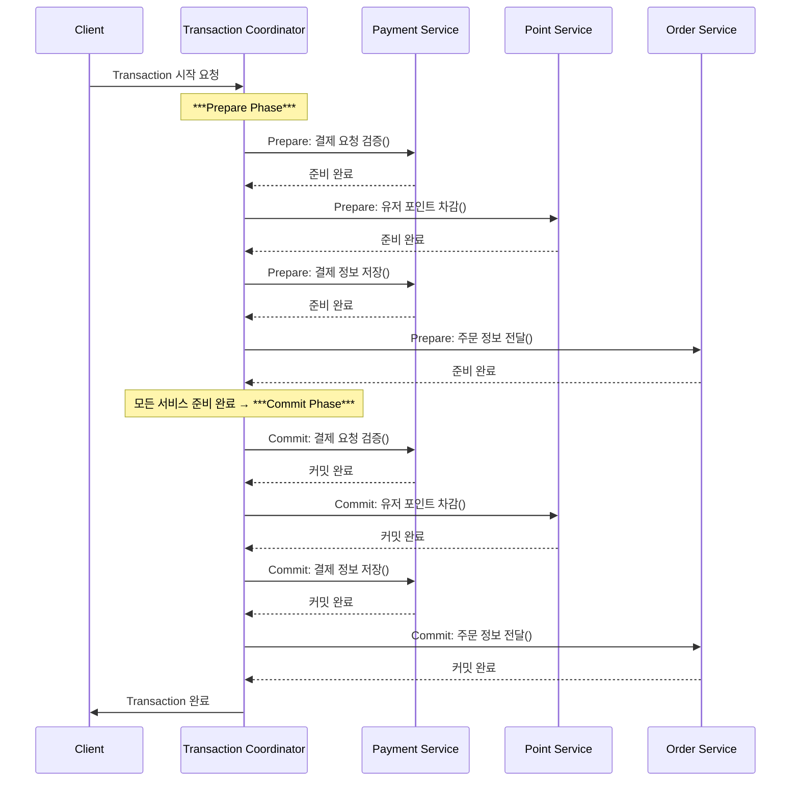
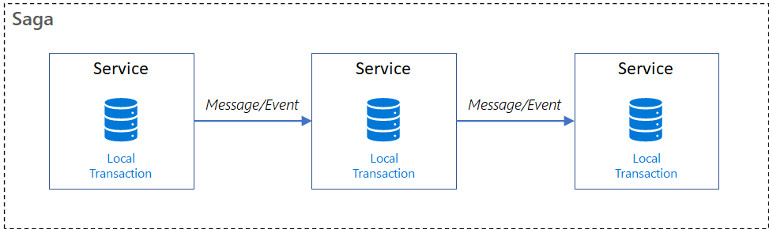
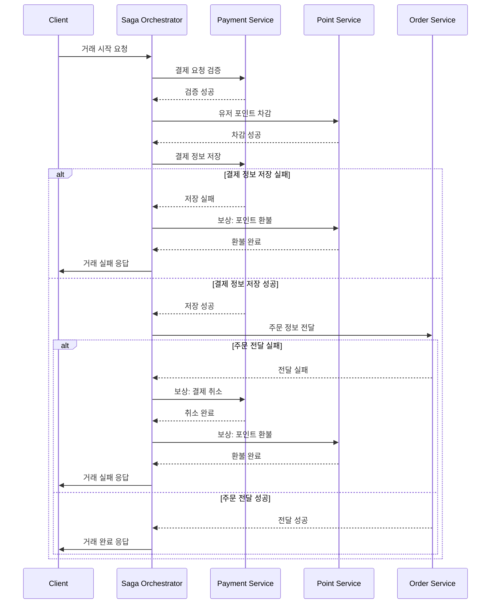

## 시나리오 분석 및 시스템 확장 고려사항

### 시나리오 분석

현재 이커머스 프로젝트 도메인
- 주문서비스
- 결제서비스
- 포인트서비스
- 상품서비스

- 주문 및 결제 비즈니스 시나리오
  1. 사용자 주문 요청
  2. 주문생성
  3. 결제
  4. 포인트 차감
  5. 상품 재고 차감
  6. 주문완료처리
  7. 주문완료시 외부 API 호출

### 기존 주문 및 결제 비즈니스 시나리오의 문제점

1. 서비스 간 강한 결합
   - 주문, 결제, 포인트, 상품 서비스가 강하게 결합 되어 있어 변경이 어렵다.
2. 단일 장애 영향 
   - 특정 서비스 장애 시 전체 주문 흐름이 중단될 가능성이 높다.
3. 트랜잭션 복잡성 
   - 여러 서비스가 순차적으로 처리되며, 장애 발생 시 롤백이 어렵다.
4. 확장성 제한 
   - 특정 서비스(예: 결제)만 트래픽이 증가해도 전체 시스템이 영향을 받을 수 있다.
5. 배포 리스크 증가 
   - 모든 서비스가 연결된 상태에서 하나의 변경이 전체 시스템에 영향을 미칠 수 있다.

### 서비스의 규모가 확장되어 MSA의 형태로 각 도메인별로 배포단위를 분리해야한다면?

#### 기존 시나리오는 어떻게 변경되어야 할까?

```text
Transaction {
	결제_요청_검증()
	유저_포인트_차감()
	결제_정보_저장()
	주문_정보_전달()
}
```
결제, 주문, 포인트 차감 등의 일련의 작업이 한 트랜잭션에서 이루어 지는 것이 아닌, 각 서비스별로 분리되어 처리되어야 한다.

```text
Transaction {
    결제_요청_검증()
}
Transaction {
    유저_포인트_차감()
}
... 
```

- MSA로 전환 시, 각 서비스별로 별도의 DB로 사용되기 때문에 이를 위한 분산 트랜잭션 처리가 필요하다.


### 분산 트랜잭션 처리 방법

#### 1. 2PC(Two-Phase Commit)



**트랜잭션 조정자(Coordinator)** 와 **두 개의 데이터베이스(Database 1, Database 2)** 가 참여하여 분산 트랜잭션의 원자성을 보장하는 방식

- **1단계: 준비단계(Prepare Phase)**
  - 트랜잭션 조정자가 모든 참여자에게 커밋 준비 여부를 물어본다.
  - 모든 참여자가 준비가 되면 다음 단계로 진행한다.

- **2단계: 커밋단계(Commit Phase)**
  - 트랜잭션 조정자가 모든 참여자에게 커밋을 요청한다.
  - 모든 참여자가 커밋을 수행하면 트랜잭션 조정자가 트랜잭션을 완료한다.

##### 2PC를 적용해 본다면



##### 2PC의 문제점
1. 성능 저하 (Latency & Overhead)
    - 2PC는 네트워크 왕복 횟수가 많아 단일 DB 대비 10배 이상의 성능 저하가 발생할 수 있음.
    - Coordinator와 데이터베이스 간 다수의 메시지 교환으로 네트워크 부하가 심함.
2. 가용성 저하 (Low Availability)
    - Coordinator가 장애 발생 시 트랜잭션이 교착 상태(Deadlock)에 빠질 수 있음.
    - Coordinator가 모든 참여자의 응답을 기다려야 하므로 응답 지연(Timeout) 발생 가능.
3. 동기(Synchronous) IPC 기반
    - 2PC는 동기 방식으로 동작하여, 한 노드가 응답할 때까지 다른 노드가 대기해야 함.
    - 현대의 마이크로서비스 아키텍처에서는 비동기 방식(Event-driven)이 선호됨.
4. 확장성 문제 (Scalability Issues)
    - 참여자가 많아질수록 커밋 과정이 길어지고, 실패 확률도 높아짐.
    - 대규모 분산 환경에서는 적합하지 않음.


#### 2. Saga Pattern



- **Saga Pattern**은 분산 트랜잭션을 여러 트랜잭션으로 분할하여 처리하는 패턴

위 그림으로 간단한 예시를 들어보자면
1. 단일 서비스 내에서 원자성으로 작업을 완료한다.
2. 서비스의 데이터베이스를 업데이트 한다.
3. 이벤트 또는 메시지를 발행하여 다른 서비스에 작업을 요청하여 다음 트랜잭션을 시작한다.
4. 로컬 트랜잭션이 실패하면 일련의 보상 트랜잭션을 실행하여 이전 작업을 롤백한다.

##### Saga Pattern을 적용해 본다면

- Choreography 방식
  - 각 서비스가 이벤트를 발행하고, 다른 서비스가 이벤트를 구독하여 처리하는 방식
  - 중앙 조정자 없이 각 서비스가 자율적으로 트랜잭션을 처리
  - 단점: 서비스가 많아지면 어떤 이벤트가 누구를 보상 트랜잭션으로 이끄는지 추적하기 어려워지고, 서비스 간 의존 관계(이벤트 의존)가 복잡해진다.

- Orchestration 방식
  - 이벤트 발행 및 구독을 중앙 조정자가 담당하는 방식
  - 중앙 조정자가 트랜잭션의 상태를 추적하고, 보상 트랜잭션을 실행
  - 단점: 단일 지점에서 트랜잭션 전 과정을 파악하기 쉬우나, Orchestrator가 복잡해질 수 있고 단일 장애점이 될 수 있다.

- Orchestration 방식을 적용해 본다면


1. 사용자 주문요청 -> Saga Orchestrator
2. Saga Orchestrator는 각 서비스에 요청을 보내고, 각 서비스는 요청을 처리한다.
3. 각 서비스는 요청을 처리한 후 결과를 Saga Orchestrator에게 응답한다.
4. 서비스가 실패했을 경우 Saga Orchestrator는 보상 트랜잭션을 실행한다(이벤트를 발행한다).


