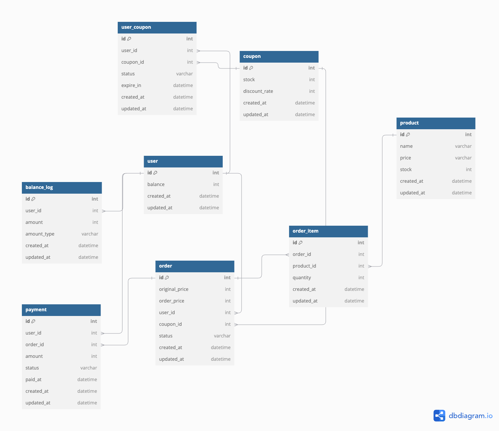

# ERD



```
Table user {

  id int [pk, increment]
  balance int
  created_at datetime [default: 'now()']
  updated_at datetime [default: 'now()']

}

Table product {

  id int [pk, increment]
  name varchar
  price varchar
  stock int
  created_at datetime [default: 'now()']
  updated_at datetime [default: 'now()']

}

Table coupon {

  id int [pk, increment]
  stock int [note: '잔여수량']
  discount_rate int
  created_at datetime [default: 'now()']
  updated_at datetime [default: 'now()']

}

Table user_coupon{

  id int [pk, increment]
  user_id int [ref: > user.id]
  coupon_id int [ref: > coupon.id]
  status varchar [note: '쿠폰 상태']
  expire_in datetime [note: '만료 일자']
  created_at datetime [default: 'now()']
  updated_at datetime [default: 'now()']

}

Table order {

  id int [pk, increment]
  original_price int [note: '할인 전 상품 가격']
  order_price int [note: '쿠폰 적용 후 구매 상품 가격']
  user_id int [ref: > user.id]
  coupon_id int [ref: > coupon.id]
  status varchar [note: '주문 상태']
  created_at datetime [default: 'now()']
  updated_at datetime [default: 'now()']

}

Table order_item {
  id int [pk, increment]
  order_id int [ref: > order.id]
  product_id int [ref: > product.id]
  quantity int [note: '주문한 상품 수량']
  created_at datetime [default: 'now()']
  updated_at datetime [default: 'now()']

}

Table balance_log {
  id int [pk, increment]
  user_id int [ref: > user.id]
  amount int [note: '양수는 충전, 음수는 차감']
  amount_type varchar [note: '사용 타입']
  created_at datetime [default: 'now()']
  updated_at datetime [default: 'now()']

}

Table payment {
  id int [pk, increment]
  user_id int [ref: > user.id]
  order_id int [ref: > order.id]
  amount int [note: '결제 금액']
  status varchar [note: '결제 상태']
  paid_at datetime [note: '결제 완료 시각']
  created_at datetime [default: 'now()']
  updated_at datetime [default: 'now()']
  note: '결제정보'
}
```
